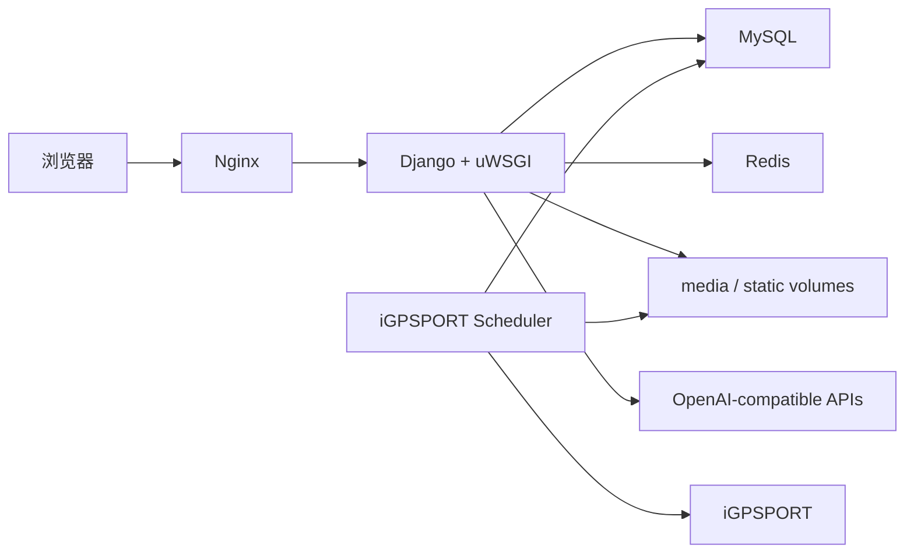

# Dovahlore

一个用于整理个人摄影、影音收藏和骑行数据的自托管站点，同时集成了只读 Site Assistant、Live2D 交互组件与 iGPSPORT 自动同步。

当前版本：**v1.2**

在线站点：[www.dovahwall.cn](https://www.dovahwall.cn)

## 项目组成

| 模块 | 入口 | 功能 |
| --- | --- | --- |
| 个人主页 | `/` | 个人介绍与视频首页；v1.2 起不显示 Agent 悬浮球 |
| DovahWall | `/s/wall` | 摄影作品墙、随机轮播、年月时间轴、标签筛选、原图查看、EXIF 与点赞 |
| DovahBase | `/s/base` | 漫画、电影、剧集的收藏、进度、评分、标签、观后感与资源信息管理 |
| DovahRide | `/s/bike/` | FIT/GPX 骑行记录、轨迹缩略图、地图回放、速度/海拔/心率/功率统计 |
| Site Assistant | `/s/agent` | 查询站内已授权数据；访客可预览，登录后才能提问、读取或清空历史 |
| 管理入口 | `/s/login` | 登录后开放上传、编辑、删除、同步及 AI 功能 |

## v1.2 更新

### Site Assistant 与 AI

- Agent 页面对访客开放预览，但聊天、历史记录和清空接口仍要求登录。
- Agent 悬浮球仅出现在 Wall、Base、Ride 等站内页面，不出现在个人视频主页。
- 对话以流式方式返回，最多保留最近 20 轮，并存放在 Redis 中。
- 数据查询使用独立 MySQL 只读账号，只允许单条 `SELECT`，限制授权表、危险关键字和最大返回行数。
- 新增全局 `fast` / `full` 两档模型：
  - `fast`：豆瓣标题与原标题拆分等轻量任务。
  - `full`：Site Assistant、AI 润色和工具调用。
- AI 配置迁移到独立 `ai_config.yaml`；模型与供应商配置分离，供应商从上到下自动故障转移。
- 豆瓣标题拆分在 AI 不可用或返回异常时会自动尝试下一供应商，全部失败后回退到本地拆分。

### Live2D

- 使用动态加载器统一初始化 Live2D，不再把模型列表写死在页面中。
- 在组件自带模型之外加入 Live2D Cubism 官方示例模型：
  `Haru`、`Hiyori`、`Mao`、`Mark`、`Natori`、`Ren`、`Rice`、`Wanko`。
- 支持模型/材质切换、截图、互动提示等组件功能。

### DovahWall

- 照片墙新增按年份和月份折叠的时间轴导航。
- 首页轮播固定随机选取 5 张照片，支持点击查看原图。
- 保留标签筛选、点赞、EXIF、分辨率和响应式照片排列。
- 优化缩略图的 EXIF 方向处理与图像资源释放，降低连续处理照片时的内存占用。
- 登录、验证码和点赞接口增加频率限制。

### DovahRide

- 延续 v1.1.3 的 iGPSPORT 自动同步、去重、旧记录关联和同步健康状态。
- scheduler 将每次同步放入独立子进程并设置超时，避免异常任务长期占用服务。
- FIT/GPX 解析器改为按需加载重型依赖，并及时释放轨迹缩略图资源。
- 骑行详情不再同时保存重复的 Python 点列表与 JSON 点列表，降低长轨迹页面的内存占用。

### 小服务器部署优化

v1.2 针对 **2 核 / 2 GB** 主机提供了一组保守默认值：

- uWSGI 从 2 个独立 worker 改为 `1 process + 4 threads`，避免重复加载 Django、OpenAI 与 Pillow。
- worker 支持按请求数和 RSS 阈值回收。
- Redis 默认 `maxmemory` 调整为 64 MB，并使用 `allkeys-lru`。
- MySQL 使用 256 MB InnoDB buffer pool，并限制连接数、临时表和每连接 buffer。
- 为 Web、Scheduler、MySQL、Redis、Nginx 设置容器内存与 PID 上限。
- Pillow、FIT/GPX 等重型库改为使用时再导入。

这些限制用于阻止异常进程拖垮整台机器；达到容器上限时相关容器可能被重启，因此生产环境仍应结合实际访问量监控和调整。

## 技术架构



主要技术：

- Python 3.12、Django、uWSGI
- Nginx、MySQL、Redis
- Docker Compose
- Pillow、ExifRead、piexif
- fitparse、gpxpy、Leaflet
- OpenAI Python SDK、PyYAML

## 快速启动

### 1. 获取代码

```bash
git clone https://github.com/Dovahlore/mysite.git
cd mysite
```

### 2. 创建环境配置

```bash
cp .env.example .env
cp ai_config.example.yaml ai_config.yaml
```

修改 `.env` 中的 Redis、MySQL、Agent 只读数据库和 iGPSPORT 凭据。真实 `.env` 已被 Git 忽略，不要提交。

默认资源限制适用于 2 GB 主机，可以按机器容量调整：

```dotenv
WEB_MEMORY_LIMIT=512m
SCHEDULER_MEMORY_LIMIT=384m
MYSQL_MEMORY_LIMIT=512m
REDIS_MEMORY_LIMIT=128m
NGINX_MEMORY_LIMIT=96m
REDIS_MAXMEMORY=64mb
```

### 3. 配置 AI

`ai_config.yaml` 同时保存模型、API 地址和 Key：

```yaml
models:
  fast: deepseek-v4-flash
  full: qwen3.7-max

providers:
  - name: aliyun
    api_key: replace-with-aliyun-key
    base_url: https://dashscope.aliyuncs.com/compatible-mode/v1

  - name: deepseek
    api_key: replace-with-deepseek-key
    base_url: https://api.deepseek.com
```

调用时会固定使用当前任务对应的 `fast` 或 `full` 模型，并按 `providers` 的书写顺序依次尝试 API。后备供应商需要能够识别同一个模型名称，否则该供应商仍会拒绝请求。

真实 `ai_config.yaml` 已被 Git 忽略，并以只读方式挂载到 Web 容器，不会进入应用镜像。

### 4. 配置 Agent 只读数据库

Site Assistant 不使用 Django 主数据库账号查询站内数据。请为它创建独立的只读 MySQL 用户，并保证用户密码与 `.env` 中的 `AGENT_DB_PASSWORD` 一致。

完整授权说明见 [myproject/AGENT_SETUP.md](myproject/AGENT_SETUP.md)。MySQL 初始化脚本只会在全新数据卷第一次启动时运行；已有数据库需要手动执行授权。

### 5. 启动

生产环境需要先配置 `compose/nginx/nginx.conf` 中的域名和 HTTPS 证书路径，然后执行：

```bash
docker compose config --quiet
docker compose up -d --build
docker compose ps
```

Web 容器启动时会自动执行数据库迁移和 `collectstatic`。

本地开发使用 HTTP 覆盖配置：

```bash
docker compose -f docker-compose.yml -f docker-compose.dev.yml up -d --build
```

访问 [http://127.0.0.1:8080](http://127.0.0.1:8080)。

### 6. 创建站点管理员

项目使用独立的 `dovahwall_admin` 表。首次启动后可以通过 Django shell 创建账号：

```bash
docker compose exec web python manage.py shell -c \
  "from dovahwall.models import admin; from dovahwall.utils.encrypt import md5; admin.objects.update_or_create(user='your-user', defaults={'password': md5('your-password')})"
```

创建后从 `/s/login` 登录。

## iGPSPORT 同步

独立的 `scheduler` 容器负责：

- 启动后执行一次增量同步。
- 按 `Asia/Shanghai` 时区每天 00:00 自动同步。
- 根据 `source + external_id` 去重。
- 将已手工上传的相同 FIT 记录关联到 iGPSPORT ID。
- 在 Ride 页面显示心跳、最近成功时间和同步结果。
- 接收登录用户提交的完整同步任务。

手动执行完整同步：

```bash
docker compose exec -T scheduler python manage.py sync_igpsport --all
```

查看 scheduler 状态：

```bash
docker compose logs --tail=100 scheduler
```

## 数据持久化与更新

Compose 使用以下命名卷：

| 数据卷 | 内容 |
| --- | --- |
| `db_vol` | MySQL 数据 |
| `redis_vol` | Redis 数据 |
| `media_vol` | 上传的照片、封面、FIT/GPX 与轨迹缩略图 |
| `static_vol` | Django `collectstatic` 输出 |

重建镜像或容器不会删除这些数据。不要执行：

```bash
docker compose down -v
```

生产环境升级前应备份 MySQL 与 `media_vol`。完整的备份、离线镜像和无 Git 部署流程见 [DEPLOY.md](DEPLOY.md)。

## 测试

容器启动后运行：

```bash
docker compose exec -T web python manage.py test
```

v1.2 当前包含 28 项测试，覆盖 Agent 访客权限、只读 SQL、AI 供应商回退、豆瓣标题拆分、Wall 时间轴、Ride 同步与基础配置。

## 版本演进

| 版本 | 主要变化 |
| --- | --- |
| v1.1 | 完成 Wall、Base、Ride 与 Site Assistant 的整体整合和容器化部署 |
| v1.1.2 | 重构照片墙与表单界面，整理部署流程，移除仓库中的运行时背景和媒体文件 |
| v1.1.3 | 加入 iGPSPORT 自动同步、任务状态、记录去重、静态图标迁移与数据卷清理 |
| v1.2 | 加入访客 Agent 预览、只读查询防护、YAML 多 API 路由、扩展 Live2D 模型、Wall 时间轴和 2 GB 主机内存优化 |

## 注意事项

- 本项目是个人自托管站点，不是通用内容管理系统。
- `.env`、`ai_config.yaml`、HTTPS 私钥和用户媒体均不应提交到 Git。
- Live2D 模型和部分前端资源通过 CDN 加载，服务器或访客网络需要能够访问对应资源。
- Site Assistant 需要支持 OpenAI-compatible Chat Completions、流式响应和 function calling 的模型。
- 上线前请修改所有示例密码、API Key、域名和证书配置。
